# Cafe Companion

An AI layer for a specialty café: guests order by chatting with a barista bot, see live and
predicted wait times, pre-order for later, get picks for their taste, and meet people at the
café. Owners get a peak-shaving engine that moves the rush into quiet hours, with dashboards
showing the impact.

**Stack:** FastAPI (Python 3.11) · React 18 + Vite + Tailwind v4 · Firebase Auth · Firestore ·
Gemini on Vertex AI · two Cloud Run services (API + web), with no load balancer.

- Design and data model: [docs/ARCHITECTURE.md](docs/ARCHITECTURE.md)

---

## Features

**For guests**
- **Conversational ordering.** "Something iced, not too sweet, oat milk." Gemini can only change
  the cart through tools, and every change is validated against the real menu and prices.
- **Live wait and readiness.** A queue model with learned per-item prep times. ETAs update live
  as orders move through the bar.
- **Pre-ordering and "ready when I arrive".** Orders are released to the bar just in time,
  or early to fill an idle gap.
- **Discovery.** Recommendations from your taste profile, order history, spending habits,
  the live weather and the time of day.
- **Dietary filter.** Type "gluten-free, high-protein, no nuts" and get only safe items.
  The allergen rules are enforced in code, not by the model.
- **Dine-in.** Join the digital waitlist, then scan the table QR to order to the table,
  pay the bill (simulated), or check in to Connect.
- **Connect.** See who's checked in and open to a chat, send a "spark" with an AI icebreaker,
  and get a 24-hour window to meet up. Messages are moderated, with block and report.
- **Loyalty.** Beans, tiers, visits, perks, and bonus beans for picking up outside the rush.

**For staff and owners**
- **Order board.** Live queue with guest notes: VIP, first visit, allergens, shifted orders.
- **Floor.** Tables, waitlist, and smart seating (best-fit table plus the least-busy server).
- **Guests.** Profiles and segments (rush regulars, flexible, lapsing, VIP, new), with one-tap
  targeting of a segment with an off-peak offer.
- **Impact.** Rush forecast, offer acceptance, the incentive size that works best, and
  before-vs-after rush share, wait, walk-outs and revenue recovered.
- **Menu, Table QR, Team.** Mark items unavailable, print daily-rotating QR codes, invite employees.

Payments are **simulated**. No card or UPI details are collected.

---

## Screenshots

Captured from a local run against the Firebase emulators with demo data.

### Guest app (mobile)

<table>
<tr><td align="center">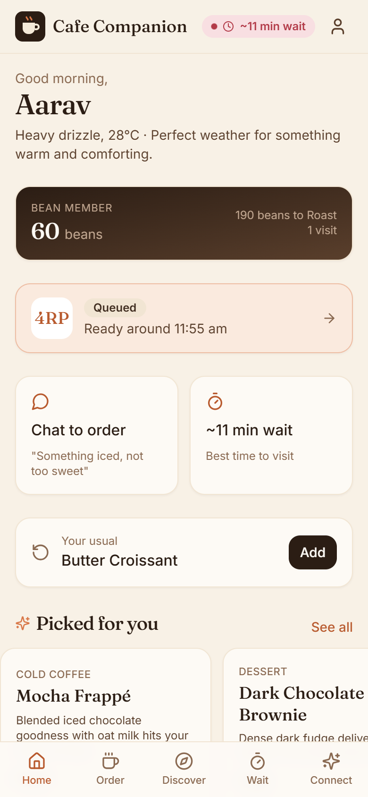<br><sub>Home: loyalty, live order, picks</sub></td><td align="center">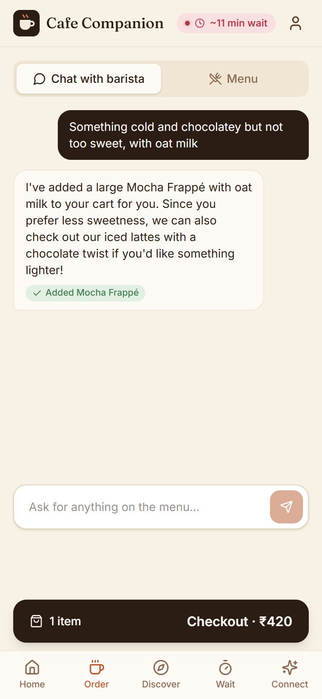<br><sub>Chat ordering</sub></td><td align="center">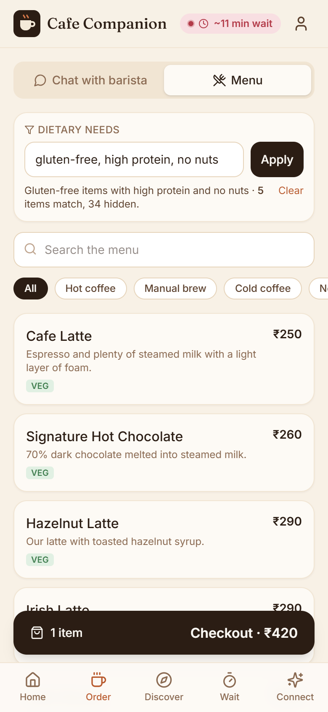<br><sub>Dietary filter</sub></td></tr>
<tr><td align="center">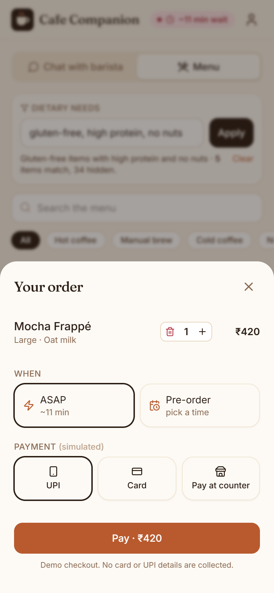<br><sub>Checkout and pre-order</sub></td><td align="center">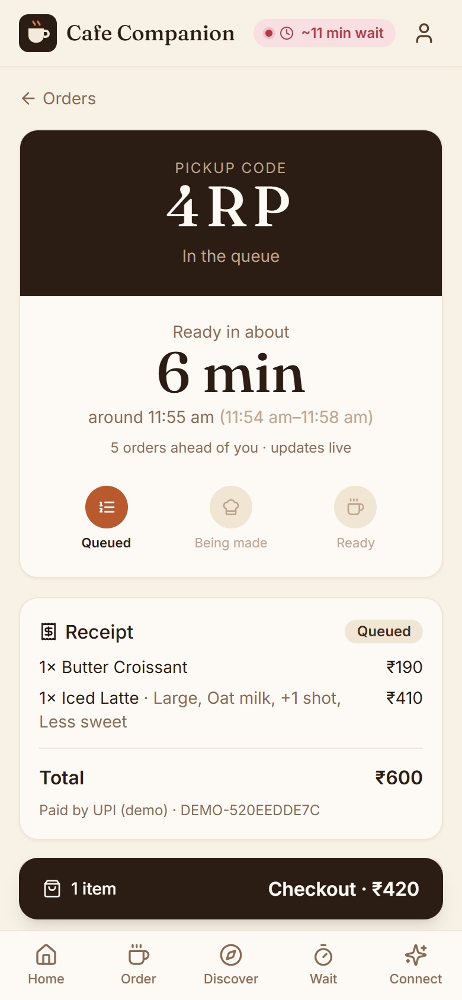<br><sub>Live order tracker</sub></td><td align="center">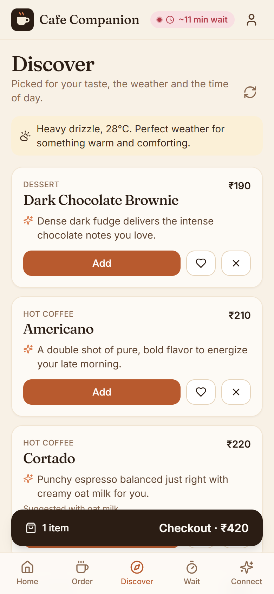<br><sub>Discover: weather-aware picks</sub></td></tr>
<tr><td align="center">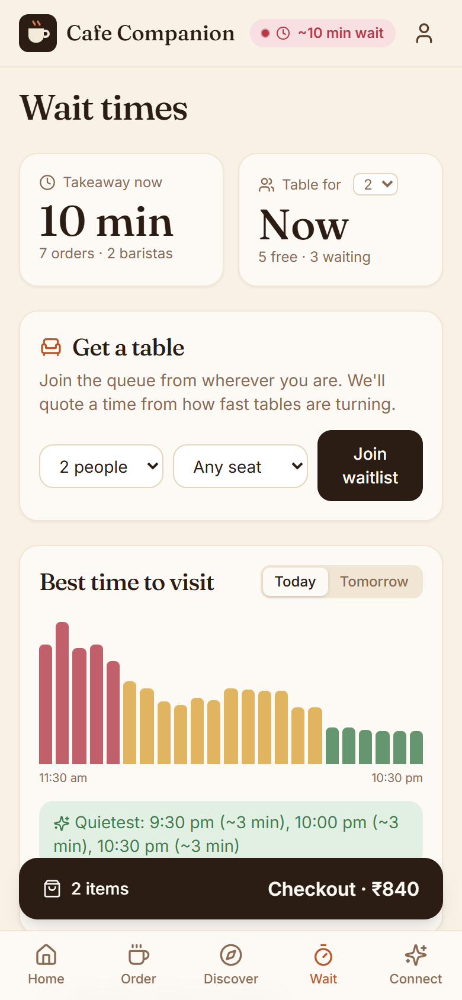<br><sub>Wait times and waitlist</sub></td><td align="center">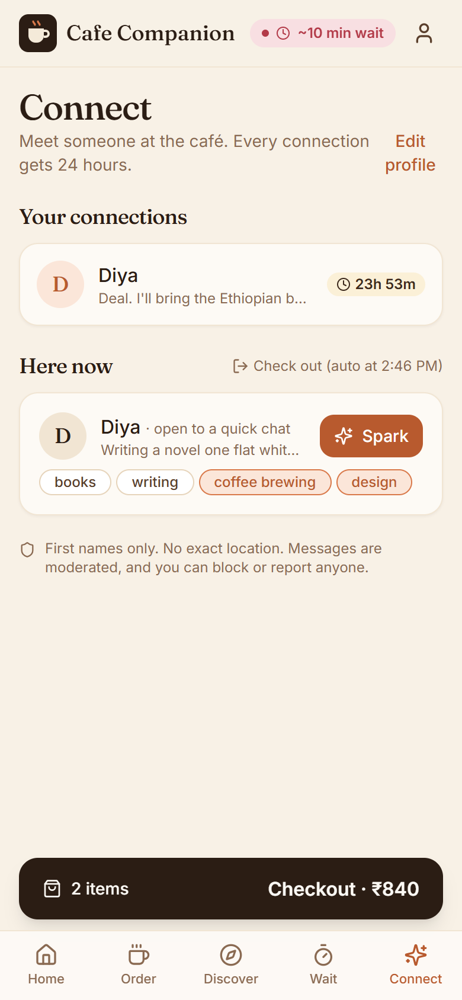<br><sub>Connect: who's here</sub></td><td align="center">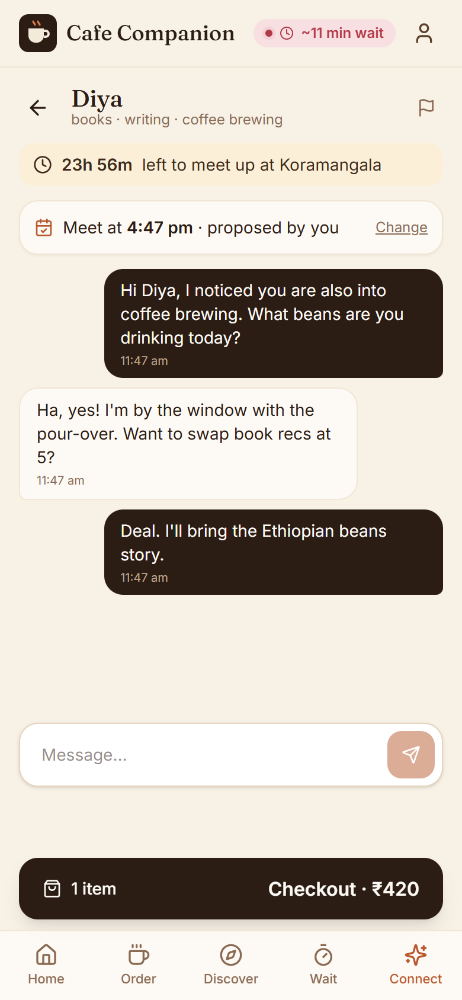<br><sub>Connect: 24h chat</sub></td></tr>
<tr><td align="center">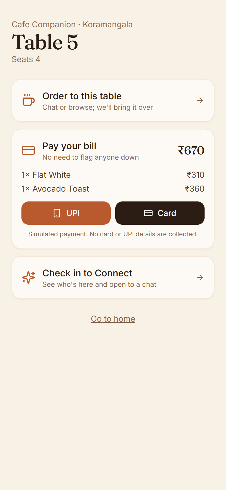<br><sub>Table QR: order, pay, connect</sub></td><td align="center">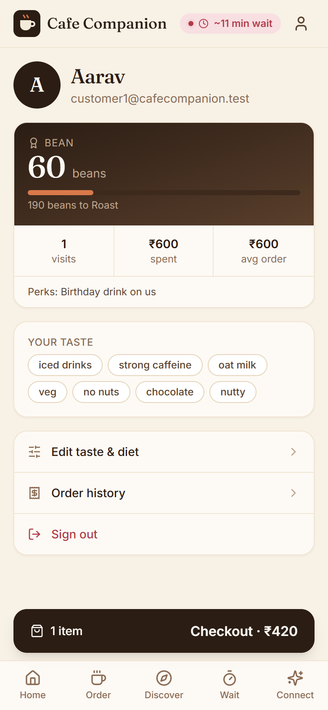<br><sub>Loyalty profile</sub></td><td align="center">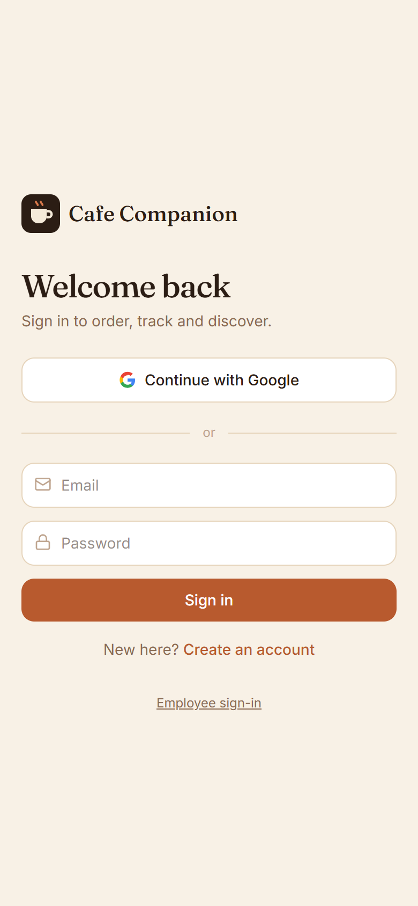<br><sub>Sign in</sub></td></tr>
</table>

### Staff console

**Order board with guest notes (VIP, first visit, allergens)**

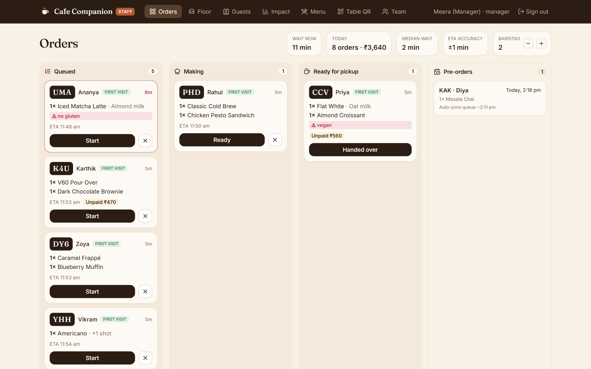

**Floor: tables, waitlist and smart seating**

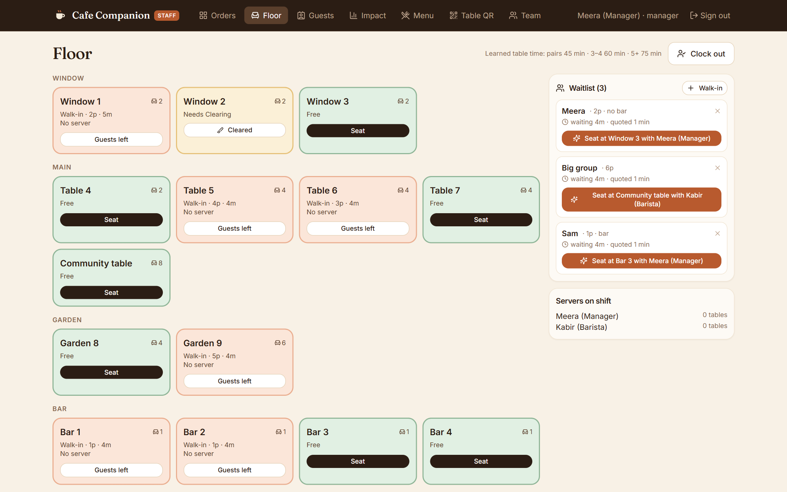

**Guests: profiles, segments and targeting**

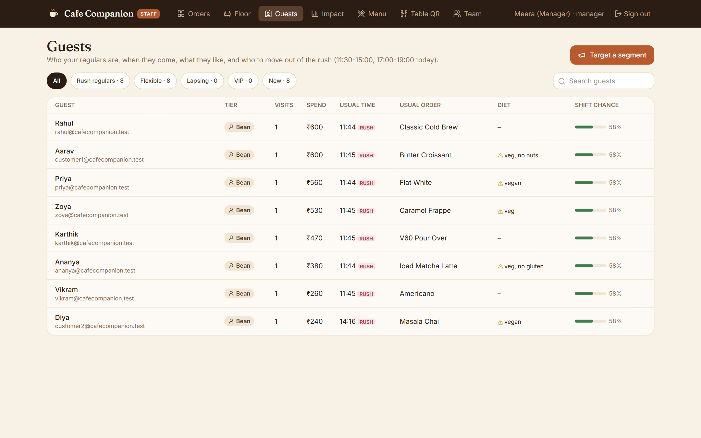

**Impact: rush forecast, offers and before vs after (simulated data)**

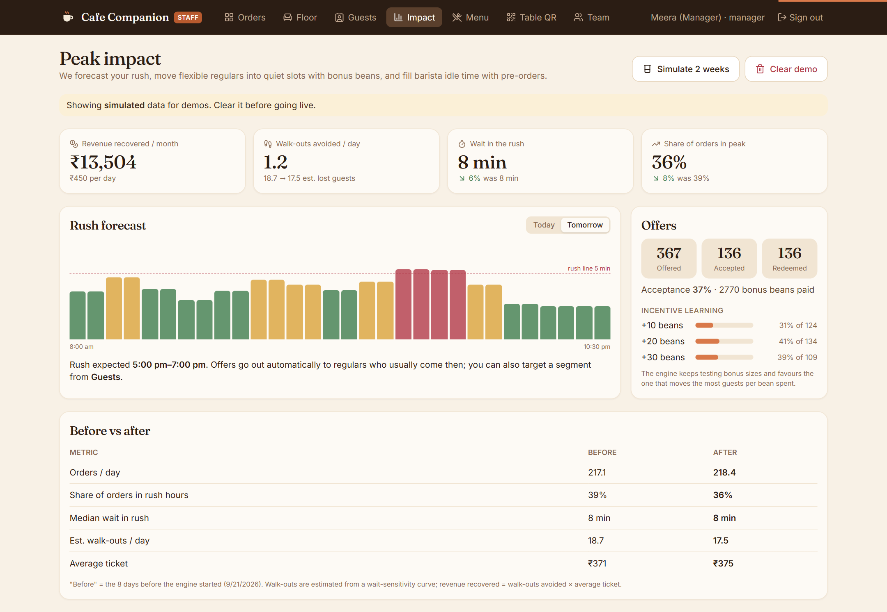

**Daily-rotating table QR codes**

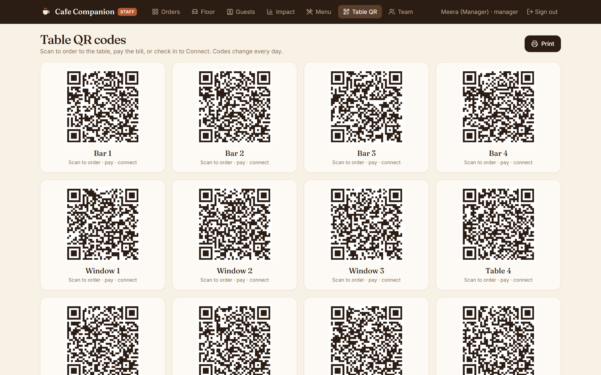

---

## Repository layout

```
backend/     FastAPI app (app/), seed + test-account scripts, tests   -> Cloud Run: cafe-api
frontend/    React SPA, nginx image with runtime config               -> Cloud Run: cafe-web
firestore/   Security rules and indexes (named database: cafedata)
deploy/      deploy.sh + .env.example
docs/        Architecture and data design
```

---

## Prerequisites

- Python 3.11+ and Node 20+
- The `gcloud` CLI, signed in with Application Default Credentials:
  ```bash
  gcloud auth application-default login
  ```
- A Firebase project with:
  - **Authentication:** Email/Password and Google providers enabled
  - **Firestore:** a named database `cafedata`
  - **APIs:** Vertex AI enabled on the same GCP project
- The Firebase CLI (`npm i -g firebase-tools`), plus Java 17 if you want the local Auth emulator

---

## Run it locally

### 1. Configure

```bash
cp .firebaserc.example .firebaserc
```

```bash
cp frontend/.env.example frontend/.env
```

- In `.firebaserc`, set your project ID.
- In `frontend/.env`, fill in the Firebase **web** config from Firebase console → Project settings →
  Your apps. Also set:
  ```
  VITE_API_URL=http://localhost:8080
  VITE_CAFE_ID=koramangala
  ```

### 2. Backend (API on :8080)

```bash
cd backend
python -m venv .venv
```

Activate the virtual environment. On Windows (Git Bash) use `.venv/Scripts/activate`; on macOS/Linux use `.venv/bin/activate`:

```bash
source .venv/Scripts/activate
```

```bash
pip install -r requirements.txt
```

One-time: deploy the Firestore rules and indexes, then seed the demo café, menu, tables and busyness curves:

```bash
firebase deploy --only firestore
```

```bash
GOOGLE_CLOUD_PROJECT=your-project-id PYTHONPATH=. python -m scripts.seed
```

Run the API:

```bash
GOOGLE_CLOUD_PROJECT=your-project-id PYTHONPATH=. uvicorn app.main:app --port 8080 --reload
```

### 3. Frontend (UI on :5173)

```bash
cd frontend
npm install
npm run dev
```

Open **http://localhost:5173**. Customers sign in at `/login` and employees at `/staff/login`.

### 4. Create test accounts

```bash
cd backend
GOOGLE_CLOUD_PROJECT=your-project-id PYTHONPATH=. python -m scripts.create_test_accounts
```

This creates (or resets) these accounts. Passwords are randomly generated on every run and
written to `backend/scripts/test_accounts.local.json`, which is gitignored and never committed.

| Role | Email | Sign in at | What to try |
|---|---|---|---|
| Customer | `customer1@cafecompanion.test` | `/login` | Onboarding quiz, chat ordering, pre-order, Discover, Wait |
| Customer | `customer2@cafecompanion.test` | `/login` | Use with customer1 to try Connect (sparks and the 24h chat) |
| Employee | `barista@cafecompanion.test` | `/staff/login` | Order board, Floor, Guests, Menu, Table QR |
| Manager | `manager@cafecompanion.test` | `/staff/login` | Everything above, plus Team invites and Impact demo data |

`.test` is a reserved domain, so these addresses have no real inbox.

- **More employees:** managers can invite them from **Staff → Team**.
- **Bootstrap managers:** emails listed in `BOOTSTRAP_MANAGERS` become managers on first sign-in.
- **Demo data:** in **Staff → Impact**, a manager can press **Simulate 2 weeks** to generate
  tagged demo history (useful for pitching), and **Clear demo** to remove it.

### Optional: fully local stack (Firebase emulators)

Run everything locally without touching real accounts or data. The Firestore emulator needs Java 21+.
A project ID starting with `demo-` keeps the emulators sandboxed. Gemini calls still go to your real project.

```bash
firebase emulators:start --only auth,firestore --project demo-cafe
```

Point the UI at the emulators with a `frontend/.env.local` file (gitignored) containing:

```dotenv
VITE_AUTH_EMULATOR=http://127.0.0.1:9099
VITE_FIRESTORE_EMULATOR=127.0.0.1:8085
VITE_FIREBASE_PROJECT_ID=demo-cafe
```

In a shell inside `backend/` (virtual environment active), set the emulator variables once:

```bash
export FIRESTORE_EMULATOR_HOST=127.0.0.1:8085 FIREBASE_AUTH_EMULATOR_HOST=127.0.0.1:9099 FIREBASE_PROJECT_ID=demo-cafe GOOGLE_CLOUD_PROJECT=your-project-id PYTHONPATH=.
```

Seed the emulator, create the test accounts inside it, then start the API:

```bash
python -m scripts.seed
```

```bash
python -m scripts.create_test_accounts
```

```bash
uvicorn app.main:app --port 8080
```

Delete `frontend/.env.local` to go back to real Auth.

---

## Tests

```bash
cd backend && PYTHONPATH=. python -m pytest -q tests
```

```bash
cd frontend && npm run lint
```

---

## Deploy (Cloud Run)

```bash
cp deploy/.env.example deploy/.env
```

Fill in `PROJECT`, `API_SA` and `BOOTSTRAP_MANAGERS`, then run:

```bash
bash deploy/deploy.sh
```

The script:
1. Creates the Artifact Registry repo (first run only).
2. Builds both images with Cloud Build.
3. Deploys `cafe-api` (as `API_SA`) and `cafe-web`. The web container writes its runtime config
   (API URL and Firebase web config) at start-up.
4. Sets CORS on the API to the web URLs.
5. Adds the web domain to Firebase Auth's authorized domains.
6. Creates the Cloud Scheduler jobs: a one-minute sweep for pre-order release and expiry, and a nightly busyness rebuild.

The backend service account needs **Agent Platform User**, **Cloud Datastore User** and **Logs Writer**.
Firestore TTL policies on `expiresAt` should be enabled for `orderSessions`, `presence`, `sparks`,
`connections`, `messages` and `waitlist`. For example:

```bash
gcloud firestore fields ttls update expiresAt --collection-group=presence --enable-ttl --database=cafedata
```

---

## Configuration reference

| Where | Variable | Purpose |
|---|---|---|
| API | `GOOGLE_CLOUD_PROJECT` | GCP project (defaults to the active credentials' project) |
| API | `FIRESTORE_DB` | Firestore database, default `cafedata` |
| API | `GEMINI_MODEL` / `GEMINI_LOCATION` | Default `gemini-3.5-flash-lite` / `global` |
| API | `ALLOWED_ORIGINS` | Comma-separated web origins for CORS |
| API | `BOOTSTRAP_MANAGERS` | Emails auto-promoted to manager |
| API | `SCHEDULER_SA`, `INTERNAL_AUDIENCE` | Who may call `/internal/jobs/*`, and the expected token audience |
| API | `WEB_URL` | `/` on the API redirects here |
| Web | `VITE_API_URL`, `VITE_CAFE_ID`, `VITE_FIREBASE_*` | Local dev (`frontend/.env`). In Cloud Run these come from env at runtime. |
| Deploy | `deploy/.env` | `PROJECT`, `REGION`, `API_SA`, `BOOTSTRAP_MANAGERS` |

The menu is modelled on a third-wave specialty-coffee lineup, with approximate prices and nutrition.
Weather comes from Open-Meteo, using only the café's coordinates.
