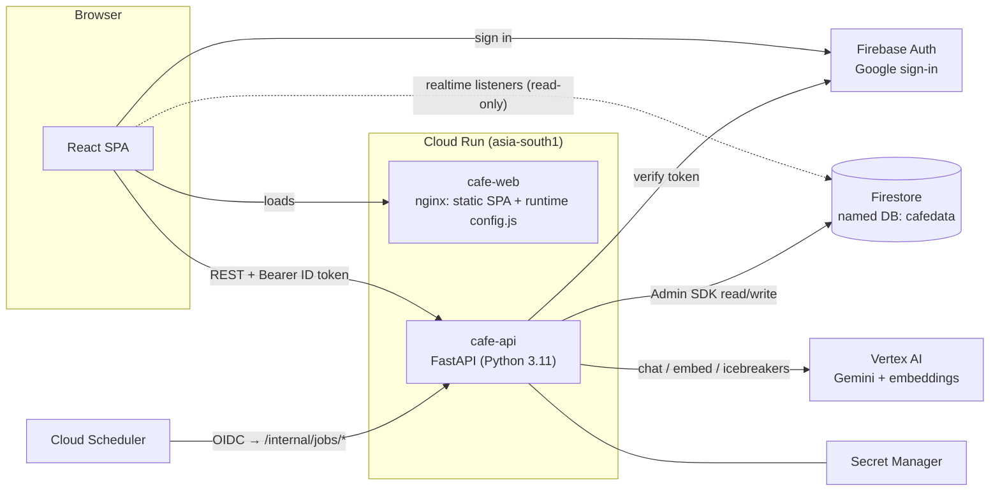
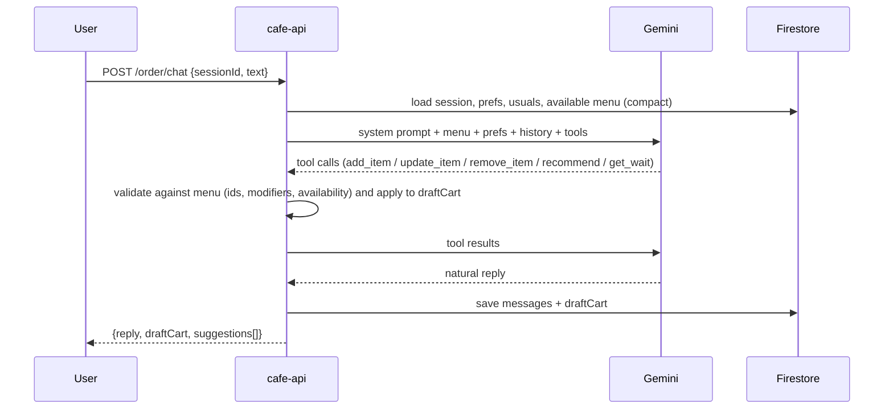
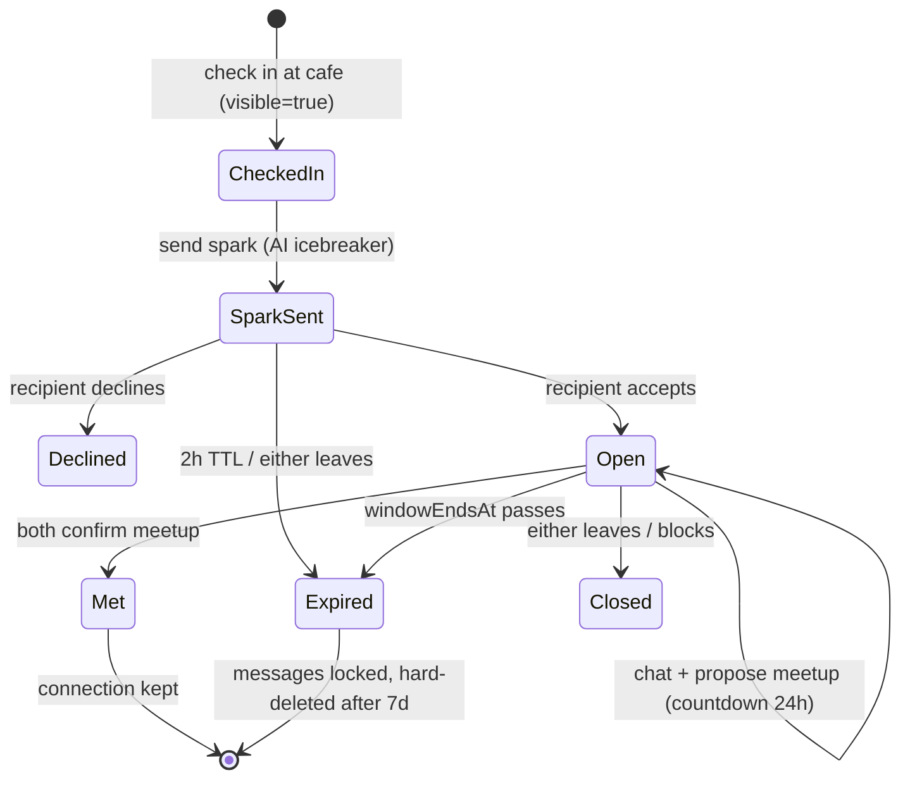

# Cafe Companion — Architecture & Data Design

> Status: **implemented and deployed** (see README for URLs and runbook). §10 covers the dine-in / loyalty additions.
> Target: your GCP / Firebase project (set in `deploy/.env`) · region `asia-south1`

Cafe Companion is an AI layer over a cafe visit, with four pillars:

| Pillar | What the guest gets | Core mechanism |
|---|---|---|
| **Smart ordering** | Order by chatting ("something iced, not too sweet, oat milk"), and the app remembers preferences | Gemini with function calling that edits a server-side cart |
| **Better waits** | A live ETA for your order, the current queue wait, the best time to come, and "order now so it's ready when you arrive" | A queue model with per-item prep times learned online, recomputed on every order state change |
| **Discovery** | Personalised food and drink picks with a one-line reason for each | Embeddings of menu items and user taste, re-ranked by context, with the reason written by Gemini |
| **Connect** | See who's open to meeting at this cafe right now, send a "spark" with an AI icebreaker, and get a **24-hour window** to chat and meet | Presence check-ins with TTL, mutual opt-in, and connections that expire |

The project follows the conventions already used in `screenerai` (FastAPI, the Firebase Admin SDK, a named Firestore database, Gemini through Vertex via `google-genai`, and React + Vite + Tailwind), so both apps work and deploy the same way.

---

## 1. System architecture



### 1.1 Services

| Service | Image | Responsibility | Runtime SA and IAM | Scaling |
|---|---|---|---|---|
| **`cafe-api`** | `python:3.11-slim` + uvicorn | All business logic and writes: ordering chat, cart and orders, ETA engine, recommendations, connect, moderation, scheduled jobs | backend service account (`API_SA`): Agent Platform User, Cloud Datastore User, Logs Writer | min 0 / max 5, concurrency 40, 1 vCPU / 512 Mi |
| **`cafe-web`** | `nginx:alpine` serving `dist/` | Static SPA. At container start, writes `/config.js` from env vars (`API_URL`, Firebase web config), so **one image works in every environment** | `cafe-web-sa`: no roles | min 0 / max 3, 256 Mi |

Both services allow unauthenticated invocation. `cafe-api` enforces its own auth by verifying Firebase ID tokens. The `/internal/*` routes accept only a Cloud Scheduler OIDC token for `cafe-scheduler-sa`.

### 1.2 Key decisions

| Decision | Choice | Why |
|---|---|---|
| Database | Existing **named Firestore DB `cafedata`** in `asia-south1` | Isolated from the `stockmarker` DB, with no Cloud SQL cost. It gives realtime listeners for order tracking and chat, TTL policies for expiring data, and vector search for recommendations |
| Realtime | **Firestore `onSnapshot` from the client**, read-only by rules | Live ETAs and chat without WebSockets on Cloud Run, which don't fit scale-to-zero well |
| Writes | **Always through `cafe-api`** | One place for validation, moderation, ETA recomputation and rate limits. Firestore rules deny all client writes |
| LLM | `gemini-3.5-flash-lite` on Vertex (`GEMINI_MODEL` env, `global` location) | Cheap and fast. Function calling is enough for cart edits |
| Embeddings | `gemini-embedding-001` (768-dim), stored on each menu item | ~40 items, so cosine similarity in memory; no vector index needed |
| Auth | Firebase Auth (Google) in the same Firebase project | Already configured. The `cafe-web` run.app domain must be added to the authorized domains |
| Staff role | Firebase custom claim `role: "staff"` | Gates the barista board and status updates |
| Payments | **Mocked** ("Pay at counter" / fake checkout) | Out of scope. Documented as a stub |

---

## 2. Data model (Firestore, database `cafedata`)

The system is multi-cafe from day one (`cafeId` on everything), seeded with a single demo cafe.

```
cafes/{cafeId}
  ├─ menu/{itemId}
  ├─ stats/live                 (single doc)
  └─ busyness/{dow}             (7 docs, Mon..Sun)
users/{uid}
  └─ interactions/{id}          (views, likes, dismissals; used to learn taste)
orderSessions/{sessionId}       (conversational ordering: chat + draft cart)
orders/{orderId}
connectProfiles/{uid}
presence/{cafeId}_{uid}         (check-ins; TTL)
sparks/{sparkId}                (connection requests; TTL)
connections/{connectionId}      (24h window)
  └─ messages/{messageId}
blocks/{uid}/blocked/{otherUid}
reports/{reportId}
```

### 2.1 Cafe and menu

**`cafes/{cafeId}`**
| Field | Type | Notes |
|---|---|---|
| `name`, `address` | string | |
| `geo` | GeoPoint | Used for the "you're nearby" check-in check |
| `timezone` | string | e.g. `Asia/Kolkata` |
| `hours` | map `{mon:[{open:"08:00",close:"22:00"}],…}` | |
| `baristasOnShift` | int | Parallelism `c` in the ETA model. Staff can edit it |
| `etaOverheadSec` | int | Fixed handoff and pickup overhead (default 45) |
| `connectEnabled` | bool | Venue-level opt-in for the Connect feature |

**`cafes/{cafeId}/menu/{itemId}`**
| Field | Type | Notes |
|---|---|---|
| `name`, `description` | string | |
| `category` | enum | `coffee · tea · cold · food · dessert` |
| `price` | int (paise) | Money is an integer to avoid float errors |
| `tags` | string[] | `iced, strong, sweet, vegan, gluten_free, caffeine_free, …` |
| `dietary` | string[] | `veg, vegan, contains_nuts, contains_dairy, …` |
| `modifiers` | map | `{milk:["dairy","oat","almond"], size:["S","M","L"], sugar:[0,1,2]}` with price deltas |
| `prepSecBase` | int | Seed prep time |
| `prepSecEwma` | float | **Learned** prep time, updated whenever an order goes from `in_progress` to `ready` |
| `prepSecVar` | float | EWMA variance, used for the ETA confidence band |
| `available` | bool | Staff toggle. Unavailable items are hidden from chat and recommendations |
| `popularity7d` | int | Rolling count, maintained by a nightly job |
| `embedding` | Vector(768) | Embedding of `name + description + tags` |

**`cafes/{cafeId}/stats/live`** (one hot doc that drives the public wait badge)
| Field | Type |
|---|---|
| `activeOrders`, `queuedItems` | int |
| `currentWaitSec` | int (ETA a new 1-item order would get right now) |
| `etaErrorP50Sec`, `etaErrorP90Sec` | int (rolling accuracy of the model, shown for honesty and used for the band) |
| `updatedAt` | timestamp |

**`cafes/{cafeId}/busyness/{dow}`**
| Field | Type | Notes |
|---|---|---|
| `hourly` | array[24] of `{orders:float, avgWaitSec:float}` | Average over the last 8 weeks, rebuilt nightly |
| `bestSlots` | array | Precomputed top quiet windows during opening hours |

### 2.2 Users and preferences

**`users/{uid}`**
| Field | Type | Notes |
|---|---|---|
| `displayName`, `photoURL` | string | From Auth |
| `prefs` | map | `{dietary:[…], milk:"oat", sweetness:0-3, caffeine:"none/low/regular/strong", temperature:"hot/iced/any", dislikes:[…]}` |
| `favorites` | string[] of `itemId` | |
| `usuals` | array | `[{itemId, modifiers, count}]` learned from orders, so "the usual" works in chat |
| `tasteVector` | Vector(768) | Weighted mean of embeddings of ordered and liked items (decayed), with a seed from the onboarding quiz text |
| `homeCafeId` | string | |
| `onboardedAt`, `createdAt` | timestamp | |

**`users/{uid}/interactions/{id}`**: `{itemId, type: view|like|dismiss|order, at}`. This log feeds `tasteVector` updates and future model training.

### 2.3 Ordering

**`orderSessions/{sessionId}`** (conversational ordering)
| Field | Type | Notes |
|---|---|---|
| `uid`, `cafeId` | string | |
| `messages` | array `{role, text, at}` | Capped at the last 30 turns |
| `draftCart` | array `{itemId, qty, modifiers, lineTotal}` | **The source of truth for the cart.** The LLM changes it only through tools |
| `status` | `active · converted · abandoned` | |
| `expiresAt` | timestamp | **TTL**, 2h |

**`orders/{orderId}`**
| Field | Type | Notes |
|---|---|---|
| `uid`, `cafeId`, `sessionId?` | string | |
| `items` | array `{itemId, name, qty, modifiers, unitPrice, prepSecSnapshot}` | Snapshot at placement |
| `total` | int (paise) | |
| `pickupCode` | string | 3 characters, shown at the counter |
| `status` | `placed → in_progress → ready → collected` or `cancelled` | |
| `timestamps` | map `{placedAt, startedAt, readyAt, collectedAt}` | Training data for prep and ETA |
| `eta` | map `{readyAt, lowAt, highAt, queuePosition, updatedAt, modelVersion}` | **Rewritten on every queue change**. The client listens to this doc |
| `etaAtPlacement` | timestamp | Frozen copy, used to measure model error |
| `targetPickupAt?` | timestamp | Set when the user ordered ahead ("ready when I arrive") |
| `source` | `chat · menu · reorder` | |

### 2.4 Connect

**`connectProfiles/{uid}`** (separate from `users` so the public surface is minimal)
| Field | Type | Notes |
|---|---|---|
| `firstName` | string | First name only |
| `bio` | string ≤ 140 | Moderated on save |
| `interests` | string[] ≤ 8 | From a curated list plus free text |
| `openTo` | string[] | `chat · cowork · language_exchange · board_games · networking` |
| `visible` | bool | Master opt-in switch. Default **false** |
| `ageConfirmed18` | bool | Required to turn on `visible` |

**`presence/{cafeId}_{uid}`**
| Field | Type | Notes |
|---|---|---|
| `cafeId`, `uid` | string | |
| `checkedInAt` | timestamp | |
| `mood` | string? | e.g. "working, open to a quick chat" |
| `expiresAt` | timestamp | **TTL**, 3h. Checking out deletes it immediately |

**`sparks/{sparkId}`**
| Field | Type | Notes |
|---|---|---|
| `fromUid`, `toUid`, `cafeId` | string | |
| `icebreaker` | string | Gemini-generated from shared interests. The sender can edit it |
| `sharedInterests` | string[] | |
| `status` | `pending · accepted · declined · expired` | |
| `createdAt` | timestamp | |
| `expiresAt` | timestamp | **TTL**, 2h (a spark only makes sense while both people are around) |

**`connections/{connectionId}`** (the **24-hour window**)
| Field | Type | Notes |
|---|---|---|
| `members` | string[2] | Sorted uids, so `connectionId = hash(sorted uids + openedAt)` |
| `cafeId` | string | |
| `openedAt` | timestamp | When the spark was accepted |
| `windowEndsAt` | timestamp | `openedAt + 24h`. The UI shows a countdown |
| `status` | `open · met · expired · closed` | `met` = both confirmed the meetup, which **keeps the connection permanently** |
| `meetup` | map `{proposedAt, proposedBy, confirmedBy:[]}` | |
| `icebreakers` | string[] | 3 conversation starters shown at the top of the chat |
| `expiresAt` | timestamp | **TTL** = `windowEndsAt + 7d`, set only while not `met`. It is a grace period before hard deletion |

**`connections/{id}/messages/{messageId}`**: `{senderUid, text, at, moderation: {flagged:bool, reason?}}`. The API rejects sends when `now > windowEndsAt` and the status isn't `met`.

**`blocks/{uid}/blocked/{otherUid}`**: `{at}`. This is checked on every spark, presence listing and message send, in both directions.
**`reports/{reportId}`**: `{reporterUid, reportedUid, context: sparkId|connectionId, reason, at}`.

### 2.5 Indexes (composite)
| Collection | Fields | Used by |
|---|---|---|
| `orders` | `cafeId ASC, status ASC, timestamps.placedAt ASC` | Queue build and barista board |
| `orders` | `uid ASC, timestamps.placedAt DESC` | Order history and usuals |
| `presence` | `cafeId ASC, checkedInAt DESC` | Who's here |
| `sparks` | `toUid ASC, status ASC, createdAt DESC` | Inbox |
| `connections` | `members ARRAY_CONTAINS, windowEndsAt DESC` | My connections |
| `menu` | vector index on `embedding` (768, COSINE) | Recommendations |

### 2.6 Security rules (summary)
- **Client writes: denied everywhere.** Every mutation goes through `cafe-api`.
- **Client reads (for realtime):**
  - `orders/{id}`: `resource.data.uid == auth.uid`, or the staff claim
  - `cafes/**`, `menu`, `stats/live`, `busyness`: any signed-in user
  - `connections/{id}` and `messages`: `auth.uid in members`
  - `sparks/{id}`: `auth.uid in [fromUid, toUid]`
  - `users/{uid}`: owner only
  - `presence`, `connectProfiles`: **not readable directly**. The API returns a filtered list, applying blocks, the `visible` flag and self-exclusion, so no one can scrape who is where

---

## 3. AI components

### 3.1 Conversational ordering (Gemini function calling)



- **Tools:** `search_menu(query, filters)`, `add_item(itemId, qty, modifiers)`, `update_item(lineId, …)`, `remove_item(lineId)`, `get_recommendations(n)`, `get_current_wait()`, `set_preference(key, value)` (e.g. "I'm lactose intolerant" is saved to `prefs`, after the user confirms).
- **Guardrails:** the LLM never produces prices or IDs that the API trusts. Every tool call is validated against the menu, and prices come from Firestore. The prompt contains only available items. Placing the order is a **separate explicit button** (`POST /orders`), never a tool, so the model cannot submit an order.
- Hard dietary constraints in `prefs` (vegan, allergens) are enforced **in code** as filters, not only in the prompt.

### 3.2 Recommendations (Discovery)

```
candidates = find_nearest(menu.embedding, users.tasteVector, k=30)
             ∪ top popularity7d (for exploration)
filter:  available, hard dietary constraints, dislikes
score  = 0.55·cosine
       + 0.15·timeOfDayFit      (e.g. breakfast items before 11am, no strong coffee late at night if caffeine="low")
       + 0.15·popularity(norm)
       + 0.10·novelty           (not ordered in the last 14 days)
       + 0.05·pairing           (goes with what's already in the cart)
top 6 → a single Gemini call writes a ≤15-word "why you'll like it" for each (cached per user+item for 24h)
```

- **Cold start:** a 5-question onboarding quiz is turned into a sentence ("likes iced, mildly sweet, oat milk, fruity") and embedded as the seed `tasteVector`.
- **Learning:** order = +1.0, like = +0.5, dismiss = −0.3, with an exponential decay (half-life 30 days). The vector is recomputed on each interaction.

### 3.3 Wait-time and readiness engine

This is a transparent queue model first, with a data-driven model added later behind the same interface.

**Per-item prep time** (learned online, updated when `in_progress → ready`):
```
observed = readyAt − startedAt   (divided across the items in the order in proportion to prepSecEwma)
prepSecEwma ← 0.8·prepSecEwma + 0.2·observed
prepSecVar  ← 0.8·prepSecVar  + 0.2·(observed − prepSecEwma)²
```

**Order prep time** (baristas batch within an order):
`P(order) = max(item) + 0.35·Σ(other items)`

**ETA for order k in the FIFO queue** with `c = baristasOnShift`:
```
remaining(o) = in_progress ? max(0, P(o) − (now − startedAt)) : P(o)
W_k          = Σ remaining(o) for orders ahead of k
readyAt_k    = now + W_k / c + P(k) + etaOverheadSec
band         = ± max(z·sqrt(Σ var) , etaErrorP50)   → lowAt / highAt
```

**When it runs:** on every order state change (placed, started, ready, collected, cancelled) and whenever staff edit `baristasOnShift`. The API rebuilds the cafe's active queue (a few dozen docs at most), recomputes every ETA, batch-writes `orders/*.eta` and `stats/live`. Clients see the update instantly through their listeners, which is the **dynamic waiting time**.

**Features built on the engine:**
| Feature | How |
|---|---|
| Live wait badge | `stats/live.currentWaitSec` |
| My order tracker | Listener on `orders/{id}`, with a progress bar and a "ready" push-style toast |
| **Order ahead / ready on arrival** | The user enters "I'm N min away". The API finds the send time such that `readyAt ≈ arrival`, and the order is held as `scheduled` until that time. v1 simply places it now if `currentWaitSec ≥ N` |
| **Best time to visit** | `busyness/{dow}.hourly` heatmap plus today's live deviation. "Quietest in the next 3h: 3:30–4:00 pm (~2 min wait)" |
| Honest accuracy | `etaAtPlacement` vs the actual `readyAt` feeds `etaErrorP50/P90`, which is shown on an admin card |

**Phase 2 (once there are about 2k completed orders):** export `orders` to BigQuery and train a gradient-boosted regressor on `(hour, dow, queue work W, c, item mix, recent throughput)`. The service keeps `predict_eta(order, queue_snapshot) → (readyAt, band)` and switches by `modelVersion`.

**Demo realism:** there is no real POS, so we ship a **barista board** (`/barista`, staff claim) to advance orders, plus a **simulator job** that injects synthetic orders following a realistic hourly curve and advances them with noisy prep times. This gives the ETA and busyness features live data from day one.

### 3.4 Connect (24-hour window)



- **Who's here:** `GET /connect/cafes/{id}/people` returns visible, checked-in people minus blocks and self, each with a match score = Jaccard(interests) + an `openTo` overlap. The response has first name, interests, mood and shared interests only.
- **Check-in integrity:** v1 requires a browser geolocation within about 150 m of `cafes.geo` **or** a QR code at the table (`/checkin?cafe=…&t=<rotating token>`). QR is preferred because it doesn't need location permission.
- **Icebreakers:** Gemini gets both public profiles (never private data) and returns 3 short, specific openers. They are cached on the spark or connection.
- **Moderation:** every bio, spark note and message passes Gemini safety settings plus a light classifier prompt. Flagged messages are held back and the sender is told.
- **Rate limits:** 5 sparks/hour and 20/day per user, and at most 1 pending spark per pair.
- **Expiry:** the TTL deletes docs. The *status* flip to `expired` is computed lazily on read (`now > windowEndsAt`), with a 15-minute sweep job for accuracy.

---

## 4. API surface (`cafe-api`)

All routes require a `Authorization: Bearer <Firebase ID token>` header unless marked otherwise.

| Method | Path | Purpose |
|---|---|---|
| GET | `/health` | Liveness (public) |
| GET | `/me` · PUT `/me/prefs` | Profile and preferences (onboarding quiz) |
| GET | `/cafes` · `/cafes/{id}` · `/cafes/{id}/menu` | Browse |
| **Ordering** | | |
| POST | `/order/sessions` | Start a chat session for a cafe |
| POST | `/order/sessions/{id}/chat` | `{text}` → `{reply, draftCart, suggestions}` |
| PATCH | `/order/sessions/{id}/cart` | Manual cart edits from the menu UI |
| POST | `/orders` | Place an order from a session or cart (`targetPickupAt?`) |
| GET | `/orders?mine` · `/orders/{id}` | History and detail (live updates via listener) |
| POST | `/orders/{id}/cancel` | Only while `placed` |
| **Waits** | | |
| GET | `/cafes/{id}/wait` | Current wait, band and queue length |
| GET | `/cafes/{id}/best-times?date=` | Hourly curve and best slots |
| POST | `/cafes/{id}/plan-arrival` | `{minutesAway, cart}` → suggested order time |
| **Discovery** | | |
| GET | `/cafes/{id}/recommendations?n=6` | Ranked items with a reason for each |
| POST | `/interactions` | like / dismiss / view |
| **Connect** | | |
| PUT | `/connect/profile` | Upsert (moderated) |
| POST | `/connect/checkin` · `/connect/checkout` | Presence |
| GET | `/connect/cafes/{id}/people` | Filtered list with match reasons |
| POST | `/connect/sparks` | `{toUid}` → draft icebreaker. With `send: true`, sends it |
| POST | `/connect/sparks/{id}/accept` · `/decline` | Accepting creates the connection (24h) |
| POST | `/connect/connections/{id}/messages` | Moderated. Rejected after the window closes |
| POST | `/connect/connections/{id}/meetup` | Propose or confirm → `met` |
| POST | `/connect/block` · `/connect/report` | Safety |
| **Staff** (`role=staff`) | | |
| GET | `/staff/cafes/{id}/queue` | Barista board |
| POST | `/staff/orders/{id}/status` | `in_progress` / `ready` / `collected` → triggers ETA recompute + prep learning |
| PATCH | `/staff/cafes/{id}` | `baristasOnShift`, item availability |
| **Internal** (Scheduler OIDC) | | |
| POST | `/internal/jobs/busyness` | Nightly: rebuild `busyness/*`, `popularity7d` |
| POST | `/internal/jobs/sweep` | Every 15 min: expire sparks and connections, release scheduled orders |
| POST | `/internal/jobs/simulate` | Every 1 min during opening hours (demo only, flag-gated) |

---

## 5. Frontend (`cafe-web`)

React 18 + TS + Vite + Tailwind v4 + react-router + Firebase JS SDK (the same stack as screenerai). It is mobile-first because guests will use it on their phones.

| Route | Screen |
|---|---|
| `/` | Home: cafe picker, live wait badge, "your usual", top 3 picks |
| `/onboarding` | Taste quiz (5 taps) and dietary needs |
| `/order` | Chat pane + draft cart drawer, with a menu grid tab for tap-to-add |
| `/orders/:id` | Live tracker: queue position, ETA with band, ready state |
| `/wait` | Wait now, best-times heatmap, "ready when I arrive" planner |
| `/discover` | Recommendation cards (like / dismiss), filters |
| `/connect` | Check-in (QR/geo), who's here, sparks inbox, active connections with **24h countdowns** |
| `/connect/:connectionId` | Chat, icebreakers, meetup proposal, block/report |
| `/barista` | Staff board: columns placed → in progress → ready |
| `/profile` | Preferences, Connect profile, visibility toggle |

The API base URL and Firebase config are read from `window.__CONFIG__` (from `/config.js`), not baked in at build time.

---

## 6. Repository layout

```
cafe/
├─ docs/ARCHITECTURE.md          ← this file
├─ firebase.json                 firestore rules/indexes for DB "cafe"
├─ firestore/
│  ├─ firestore.rules
│  └─ firestore.indexes.json
├─ backend/                      → Cloud Run: cafe-api
│  ├─ Dockerfile
│  ├─ requirements.txt
│  ├─ app/
│  │  ├─ main.py                 FastAPI app, CORS, routers
│  │  ├─ auth.py                 Firebase token + staff claim + scheduler OIDC
│  │  ├─ db.py                   Firestore client (database="cafe")
│  │  ├─ models.py               Pydantic schemas (mirror of §2)
│  │  ├─ routers/                ordering, orders, waits, discovery, connect, staff, internal
│  │  ├─ services/
│  │  │  ├─ llm.py               google-genai client, tool loop, moderation
│  │  │  ├─ ordering_agent.py    tools + cart validation
│  │  │  ├─ eta.py               queue model, prep learning, busyness
│  │  │  ├─ recommender.py       embeddings, vector search, scoring
│  │  │  └─ connect.py           presence, matching, sparks, windows
│  │  └─ jobs/                   busyness, sweep, simulator
│  ├─ scripts/seed.py            demo cafe + ~30 menu items + embeddings
│  └─ tests/                     eta + cart validation + connect window unit tests
├─ frontend/                     → Cloud Run: cafe-web
│  ├─ Dockerfile                 node build → nginx:alpine
│  ├─ nginx.conf                 SPA fallback, cache headers
│  ├─ docker-entrypoint.sh       renders /config.js from env
│  └─ src/ (lib, context, components, pages, types.ts)
└─ deploy/
   ├─ setup.sh                   one-time: DB, SAs, IAM, AR repo, TTL policies, scheduler
   └─ deploy.sh                  build + deploy both services
```

## 7. Deployment

1. **One-time setup (`deploy/setup.sh`)**
   - `gcloud firestore databases create --database=cafe --location=asia-south1`
   - Service accounts `cafe-api-sa`, `cafe-web-sa`, `cafe-scheduler-sa` and their IAM bindings
   - Artifact Registry repo `cafe` in `asia-south1`
   - TTL policies on the `expiresAt` field for `orderSessions`, `presence`, `sparks` and `connections`
   - Deploy the rules and indexes (`firebase deploy --only firestore`), including the vector index
   - Cloud Scheduler jobs for the busyness, sweep and simulate jobs
2. **Deploy (`deploy/deploy.sh`)**: `gcloud run deploy cafe-api --source backend …` and then `gcloud run deploy cafe-web --source frontend --set-env-vars API_URL=<api url>,…`. After that, set `cafe-api`'s `ALLOWED_ORIGINS` to the web URL.
3. **Manual step:** add the `cafe-web` run.app domain to Firebase Auth → Authorized domains.
4. **Seed:** `python backend/scripts/seed.py` (demo cafe, menu and embeddings, and a staff claim for your account).

Note: scripts take the project from `deploy/.env` and pass `--project` explicitly; they don't change your global gcloud config.

## 8. Cost and risk notes
- Everything scales to zero. The main variable cost is Gemini calls, capped by a per-user limit of 30 chat turns per hour and the 24h cache on recommendation reasons.
- `stats/live` is a hot doc. At about 1 write per order event it stays far below Firestore's roughly 1 write/sec per-doc guideline for a single cafe.
- **Connect is the riskiest feature** (safety and privacy). Mitigations: off by default, first names only, no exact location shown, block/report, moderation, 18+ confirmation, TTL deletion of messages. A venue-level `connectEnabled` switch acts as a kill switch.

## 9. Build order (after sign-off)
1. Scaffold + setup script + seed → both services deployed with `/health` and a sign-in page
2. Menu, manual cart, orders, barista board, **ETA engine** + simulator
3. Conversational ordering agent
4. Onboarding, embeddings and recommendations
5. Best times + arrival planner
6. Connect (profile, presence, sparks, 24h connections, moderation)


---

## 10. Additions: loyalty, dynamic menu, dietary filter, dine-in floor, table checkout

| Feature | Where | How it works |
|---|---|---|
| **Smart loyalty profile** | `services/loyalty.py`, `users.loyalty` | 1 bean per Rs 10; tiers Bean / Roast (250) / Reserve (800); visits = distinct local days; `avgTicket` feeds a *price-comfort* term in recommendations. Shown on Home ("welcome") and Profile. |
| **Dynamic recommendations** | `services/context.py`, `recommender.py` | Open-Meteo weather at the café's coordinates (15-min cache) becomes a mood of *cosy* (rain or <21°C feels-like), *hot* (≥29°C), or *mild*. Adds a 0.10 weather-fit term: warm, chocolatey and spiced items when cosy; iced, light and fizzy items when hot. Time of day was already included. **No demographic targeting**: behaviour (history, spend) is used instead. |
| **Allergen and preference filter** | `services/menu_filter.py`, `POST /cafes/{id}/menu/filter` | Gemini maps free text to `{avoidAllergens, diet, maxKcal, minProteinG, maxSugarG, maxSodiumMg, caffeine, temperature}`. **Code** applies it against per-item allergen tags and `nutrition`. Keyword fallback if the model is down. Allergens the guest named are also keyword-checked, so they can't be dropped. |
| **Predictive table waits** | `services/floor.py` (`floor-v1`) | Dwell time per party-size bucket (EWMA of seated to cleared, i.e. historical checkout patterns), plus bussing turnover, plus waiting parties greedily pre-assigned. The result is a quote per party. Takeaway waits still come from the kitchen queue model (`queue-v1`). |
| **Smart table assignment** | `floor.suggestions()`, staff **Floor** page | For each waiting party: the free table with the fewest wasted seats that respects bar / no-bar, and the on-shift server with the fewest active tables (tie: least recently seated). Seating is one tap. |
| **Tableside QR checkout** | `/checkin?cafe&table&t`, `POST /cafes/{id}/tables/{t}/pay` | A daily-rotating HMAC token per table. One scan lets the guest order to the table (dine-in orders show on the barista board), pay their open tab (simulated), or check in to Connect. **Face-scan payment deliberately not built** (biometric data). |

New collections: `cafes/{id}/tables/{tableId}`, `cafes/{id}/waitlist/{partyId}` (TTL `expiresAt`),
`cafes/{id}/shift/{uid}`, `cafes/{id}/stats/floor`. Rules: tables and shift are staff-read, and waitlist is
staff-read or own-entry. Menu items gained `nutrition {kcal, proteinG, sugarG, sodiumMg}`.
